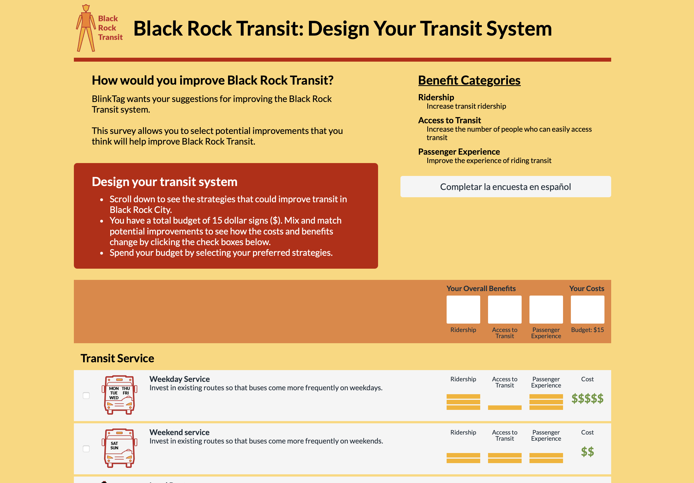

# Bus Bux

Created by Anthony Hewitt

 

## Overview

This is a extension of BlinkTag's "[Design Your Transit System](https://github.com/BlinkTagInc/design-your-transit-system)". In this version, users can create a transit survey simply by entering information into a Word document. This approach makes it more user-friendly, especially for non-programmers.
   
 

## Example Survey

[design-your-transit-system-customizer.vercel.app](https://design-your-transit-system-customizer.vercel.app)

 

## Getting Started

**1. Install [Node.js](https://nodejs.org/en)**

**2.Create a [MongoDB database](https://www.mongodb.com/)**

**3. Add a `.env` file to the [Website_Source_Code](https://github.com/anthew/design-your-transit-system_customizer/tree/master/black_rock_survey/Website_Source_Code) folder with the `MONGODB_URI` of the MongoDB database you created.**

    MONGODB_URI=mongodb://127.0.0.1:27017/yoursurveydatabase

**4. Follow the instructions in [Designing Survey](https://github.com/anthew/design-your-transit-system_customizer/blob/master/Designing%20Survey.docx) to customize the survey and deploy it to port 3000.**

**5. To download the results of a survey as a .csv file, visit the following link and enter the `Username` and `Password` of your MongoDB database.**

    http://localhost:3000/api/export

 

## License

Just like the original code from BlinkTag, this project is licensed under [GNU General Public License v3.0](https://github.com/anthew/design-your-transit-system_customizer/blob/master/LICENSE).
